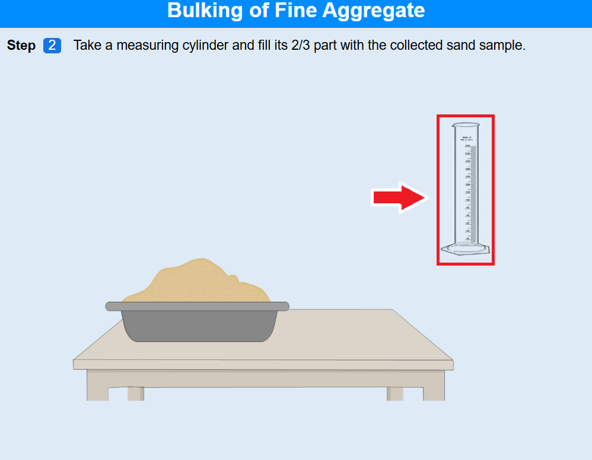
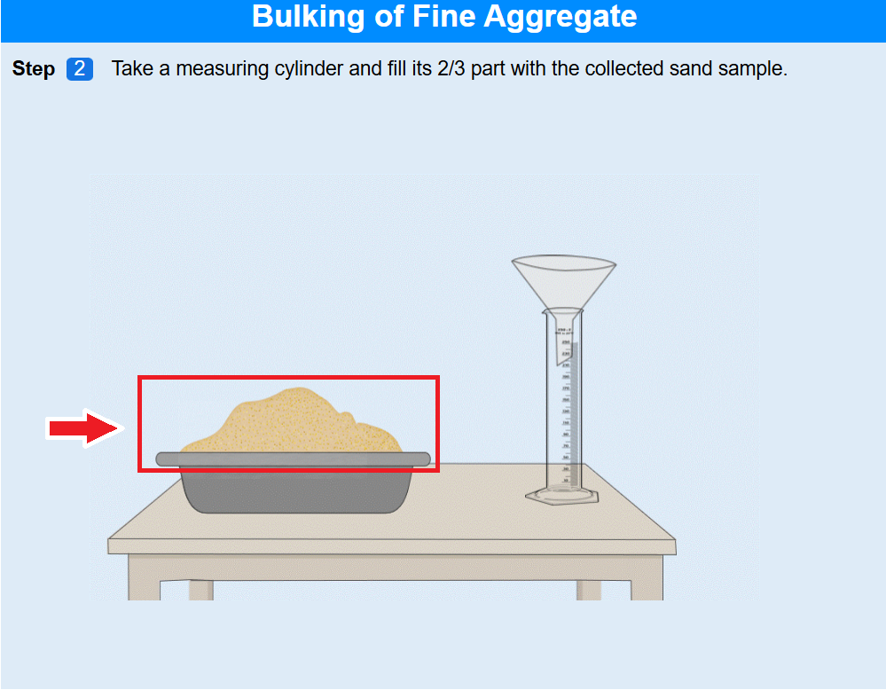
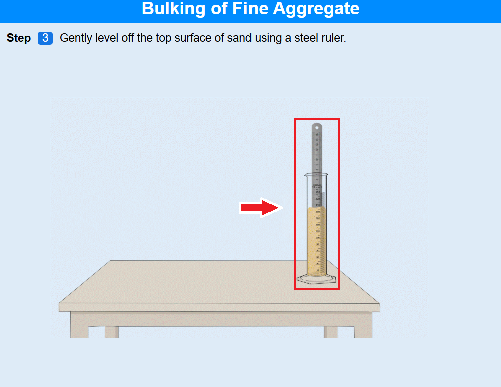
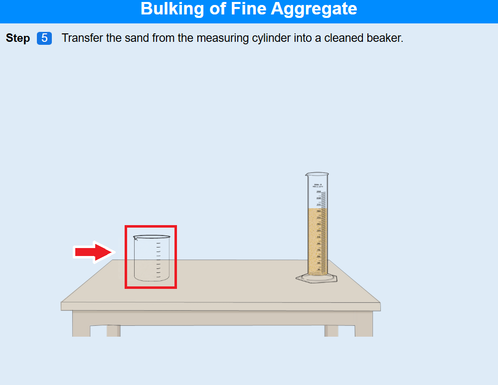
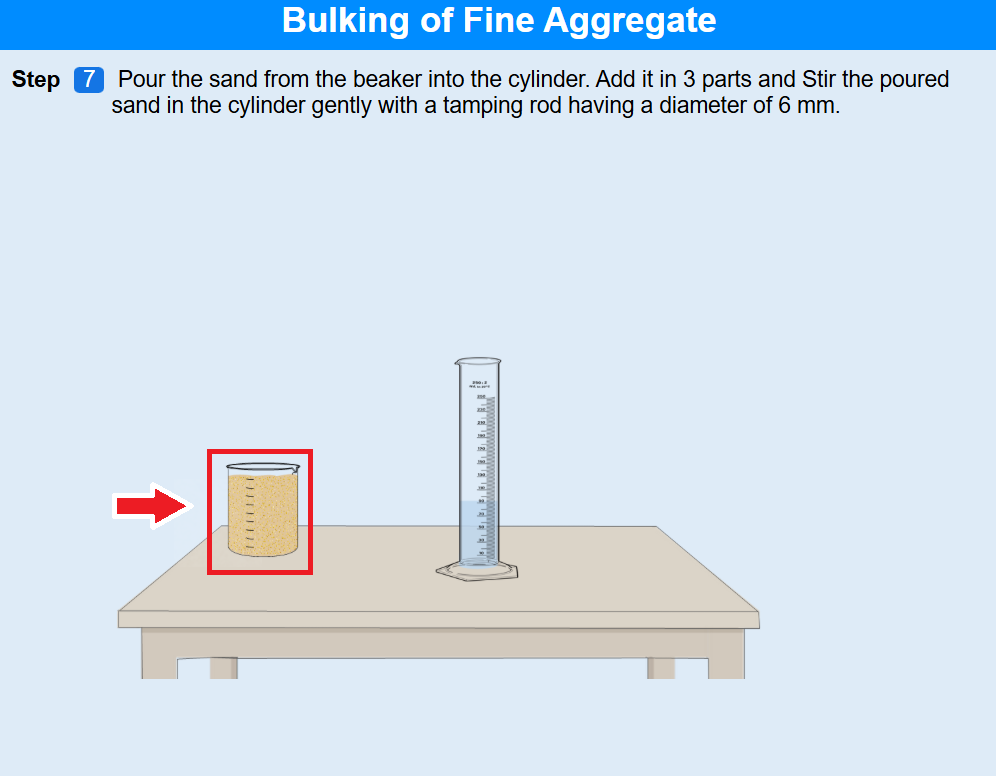
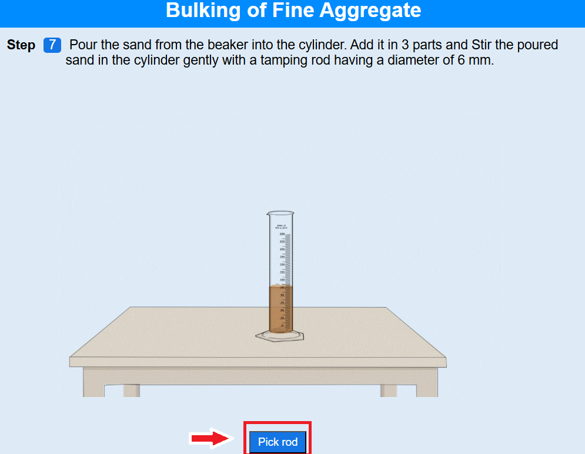
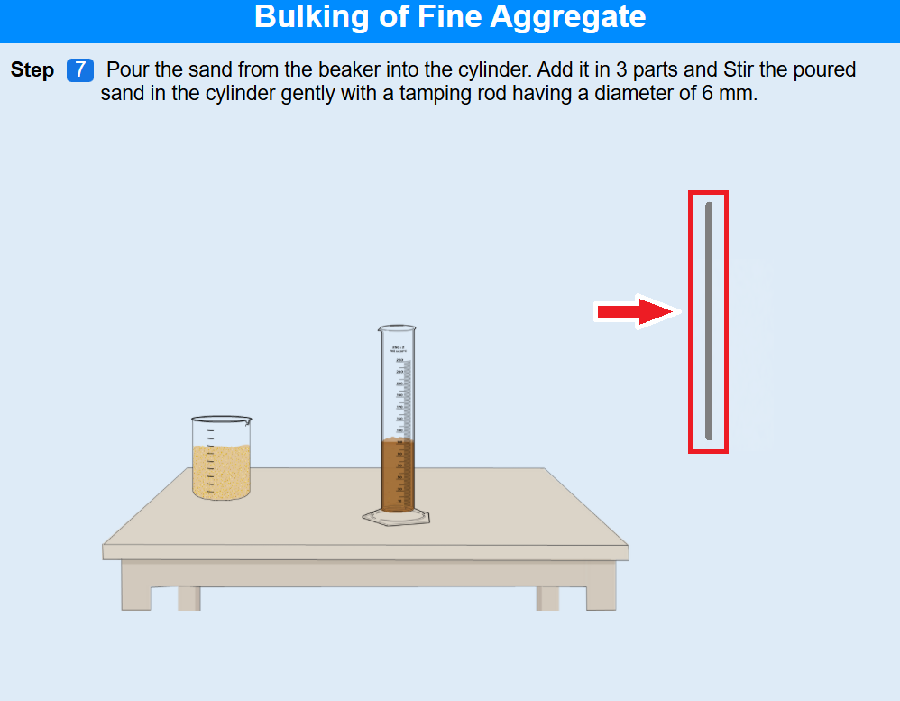

#### Step 1: Start the Experiment  

• Click the Next button to begin the experiment.
  

#### Step 2: Filling the Measuring Cylinder 

• Click on the measuring cylinder.
  

• Click on the funnel placed over the cylinder. 
• Click on the sand container to fill sand into the cylinder.
  

• Click Next to proceed. 

#### Step 3: Leveling the Sand  

• Click on the scale/ruler to lift it.
  

• Click on the top surface of the sand to level it.
  

• Click Next. 

#### Step 4: Preparation for Pouring  

• Click Next to arrange the setup for pouring. 

#### Step 5: Transferring Sand  

• Click on the measuring cylinder to pour sand into the beaker.
  

• Click Next. 

#### Step 6: Filling Water

• Click on the water source to fill water into the measuring cylinder.
  

• Click Next. 

#### Step 7: Mixing Process  

• Click on the beaker to move it to the correct position.
  

• Click Pick Rod.
  

• Click on the rod to stir the mixture.
  

• Lift the beaker when instructed.
  

• Repeat stirring as guided. 
• Click Next to continue. 

#### Step 8: Sample Collection  

• Click Second Sample.
  

• Similarly, click Third Sample. 
• Click Next. 

#### Step 9: Observations  

• Click First Sample Reading. 
• Click Second Sample Reading. 
• Click Third Sample Reading. 
• Click Note Percentage (%). 

#### Step 10: Conclusion  

• Click Conclusion to view the result. 

#### Final Step: Post Test  

• Click Post Test to complete the experiment. 